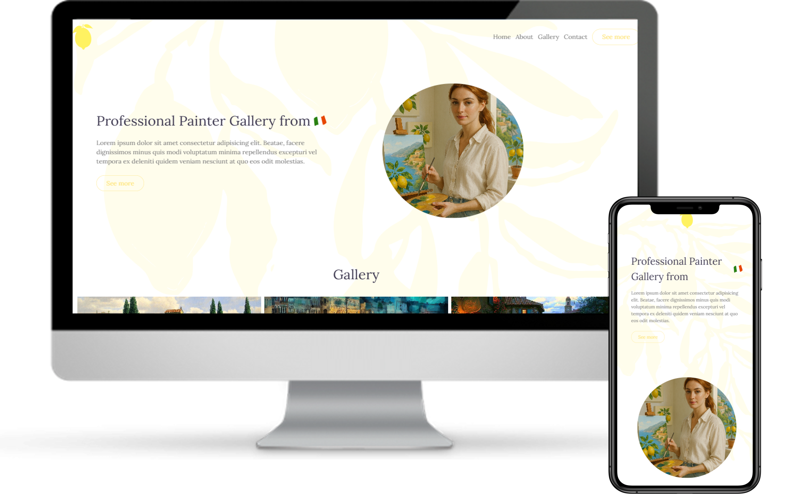

# Cadastro de Usuários
Portfólio de pinturas desenvolvido com Grid CSS, utilizando AOS para animações e Lightbox para visualização das imagens.

## 💻 Demonstração

## ✨ Recursos

- HTML5
- TailwindCSS
- CSS3
- JavaScript (Bibliotecas AOS/Lightbox)
- Design responsivo
- Código limpo e organizado

## 📌 Observações

Projeto criado com foco na prática de Grid CSS e na integração de bibliotecas externas, como AOS e Lightbox, para aprimorar a experiência visual e interativa.

## 📬 Contato

- [GitHub Profile](https://github.com/VictorBonifac10) 
- [LinkedIn](https://www.linkedin.com/in/victor-alves-bonifacio/)
